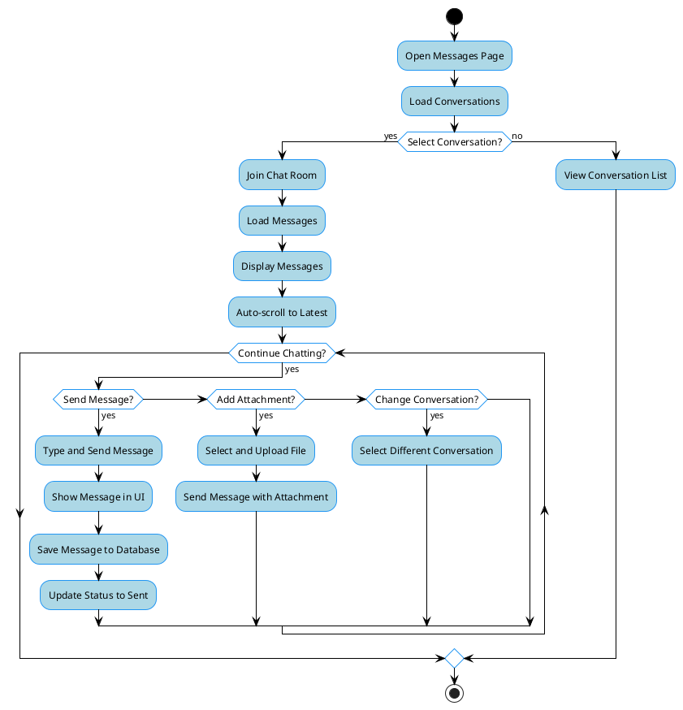
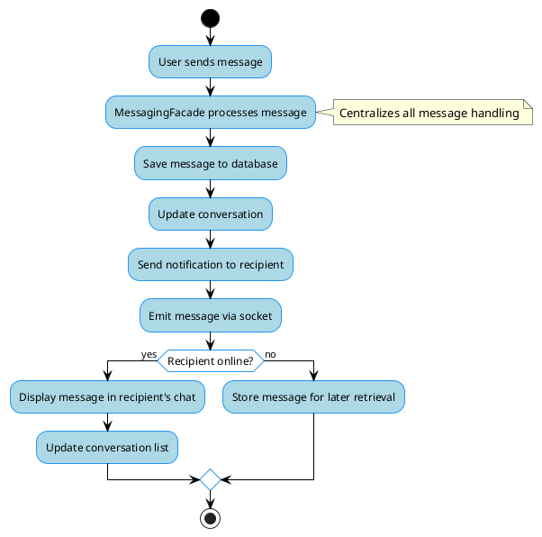
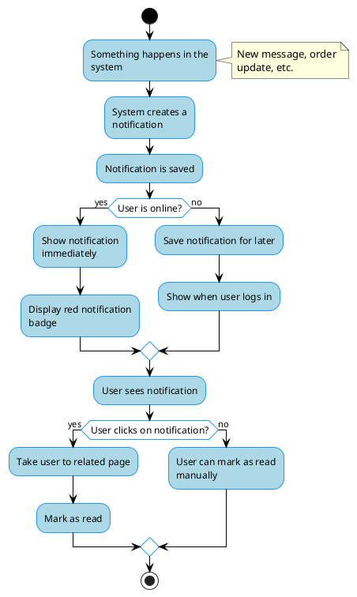
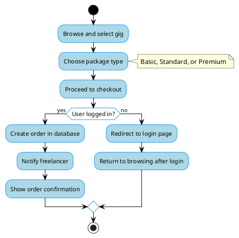
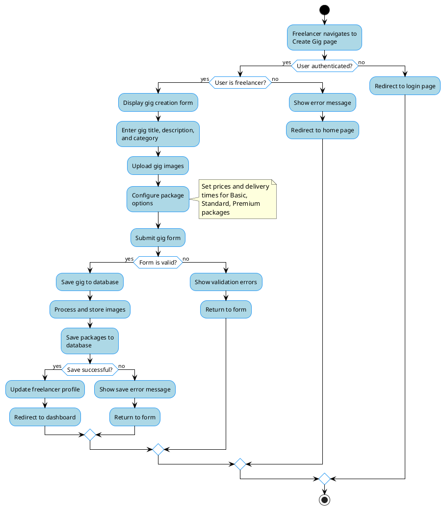
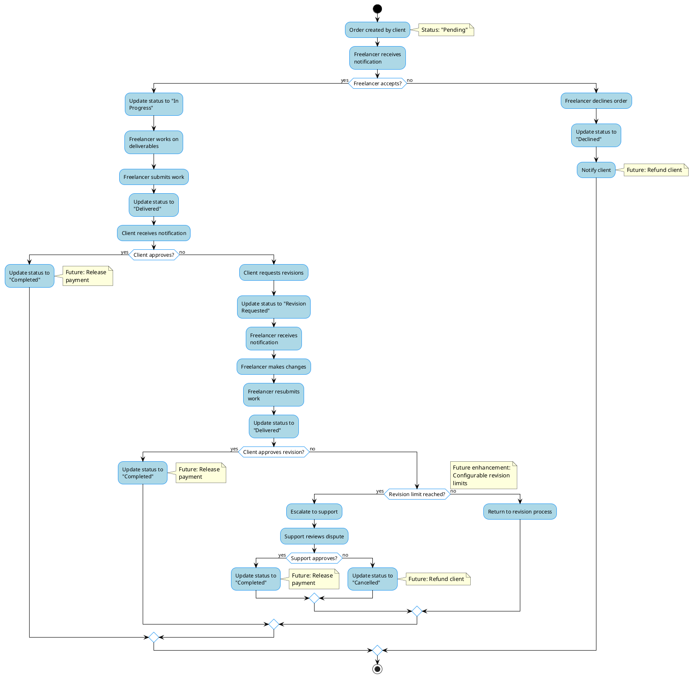

# Activity Diagrams - Freelancing Web Application

## Overview
These activity diagrams illustrate the key processes in the Freelancing Web Application, showing the flow of activities and decisions for critical operations.

## Real-Time Messaging Process



## Real-time Messaging Process with Facade Pattern



## Notification System



## Order Creation Process



## Gig Creation Process



## Real-Time Messaging Implementation

```mermaid
flowchart TD
    Start([Start]) --> SetupSocket[Configure Socket.IO]
    SetupSocket --> DefineOptions[Set Transport Options]
    DefineOptions --> EnableReconnection[Enable Auto Reconnection]
    EnableReconnection --> ConfigurePing[Configure Ping Interval/Timeout]
    
    ConfigurePing --> RegisterEvents[Register Socket Event Handlers]
    
    RegisterEvents --> RegisterUserEvents[Register User Events]
    RegisterUserEvents --> SetupJoinEvent[Setup Join Event]
    
    WaitForJoin --> UserJoins{User Joins?}
    UserJoins -->|No| ContinueWaiting[Continue Waiting]
    ContinueWaiting --> UserJoins
    
    UserJoins -->|Yes| ValidateUserId[Validate User ID]
    ValidateUserId --> UserIdValid{User ID Valid?}
    UserIdValid -->|No| LogWarning[Log Warning]
    LogWarning --> WaitForJoin
    
    UserIdValid -->|Yes| AssociateUser[Associate User ID with Socket ID]
    AssociateUser --> JoinUserRoom[Join User-Specific Room]
    JoinUserRoom --> JoinAllUsers[Join All Users Room]
    JoinAllUsers --> MarkUserOnline[Mark User as Online]
    MarkUserOnline --> NotifyOnlineStatus[Notify All Clients of Status Change]
    NotifyOnlineStatus --> SendConfirmation[Send Join Confirmation]
    SendConfirmation --> SendOnlineUsers[Send List of Online Users]
    
    SendOnlineUsers --> ProcessMessageEvents[Process Message Events]
    
    ProcessMessageEvents --> MessageReceived{Message Sent?}
    MessageReceived -->|No| WaitForMessages[Wait for Messages]
    WaitForMessages --> MessageReceived
    

!define ACTIVITY_BG #ADD8E6
!define ACTIVITY_BORDER #2196F3
!define DECISION_BG white
!define DECISION_BORDER #2196F3

skinparam backgroundColor white
skinparam handwritten false

skinparam ActivityBackgroundColor ACTIVITY_BG
skinparam ActivityBorderColor ACTIVITY_BORDER
skinparam ActivityBorderThickness 1
skinparam ActivityFontName Arial
skinparam ActivityFontSize 12
skinparam ActivityFontColor black
skinparam ActivityDiamondBackgroundColor DECISION_BG
skinparam ActivityDiamondBorderColor DECISION_BORDER
skinparam ActivityArrowColor black

skinparam ActivityStartColor black
skinparam ActivityEndColor black

skinparam maxMessageSize 150
skinparam wrapWidth 150

start

:Configure Socket.IO;
:Set transport options;
:Enable auto-reconnection;
:Configure ping intervals;

:Register socket event handlers;

fork
  :Handle user events;
  note right: Join/leave room, typing
fork again
  :Handle message events;
  note right: New message, read status
fork again
  :Handle system events;
  note right: Connect, disconnect
endfork

:Process new message;

if (Message valid?) then (yes)
  :Save message to database;
  :Broadcast to recipients;
  :Update conversation;
else (no)
  :Return error to sender;
endif

stop

@enduml
```

## Description

These activity diagrams illustrate the key processes in the Freelancing Web Application:

### Real-Time Messaging Process
This diagram shows the flow of activities involved in the real-time messaging feature, which was previously fixed to address various issues:
- Socket connection initialization
- Conversation selection and room joining
- Message caching and retrieval
- Message composition and sending
- Error handling and retry mechanisms
- Attachment handling

Key improvements highlighted include:
- Proper socket connection configuration
- Enhanced message reception handling
- Improved message fetching and display
- Direct chat updates for immediate visibility
- Message sorting by timestamp
- Automatic scrolling to latest messages

### Order Creation Process
This diagram illustrates how clients create orders in the system:
- Gig browsing and selection
- Package selection (Basic, Standard, Premium)
- Authentication verification
- Requirement specification
- Payment processing
- Order creation and notification

### Real-Time Messaging Implementation
This technical diagram shows the backend implementation of the real-time messaging system:
- Socket.IO configuration with proper transport options
- Event handler registration
- Message validation and broadcasting
- Online status tracking
- Database persistence
- Conversation updates

### Gig Creation Process
This diagram shows how freelancers create service offerings:
- Authentication and authorization checks
- Basic information entry
- Image upload
- Package definition for different service tiers
- Validation and persistence
- Profile updates

These activity diagrams provide a comprehensive view of the control flow in key processes of the Freelancing Web Application, highlighting both user interactions and system processing.

## Order Completion Process



### Order Completion Process
This diagram illustrates the workflow after an order is created:
- Order acceptance/rejection by freelancer
- Work delivery and client review
- Revision requests and handling
- Dispute resolution process
- Status transitions throughout the order lifecycle

Note: Payment processing is marked as a future enhancement, as it's not currently implemented in the system.
