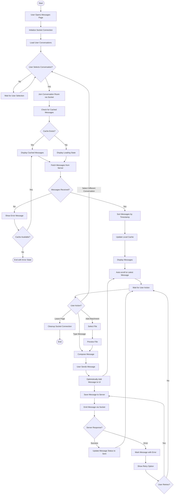
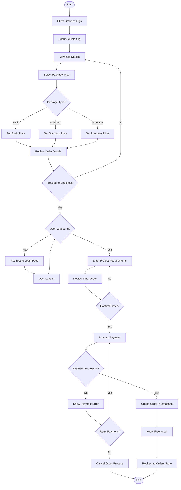
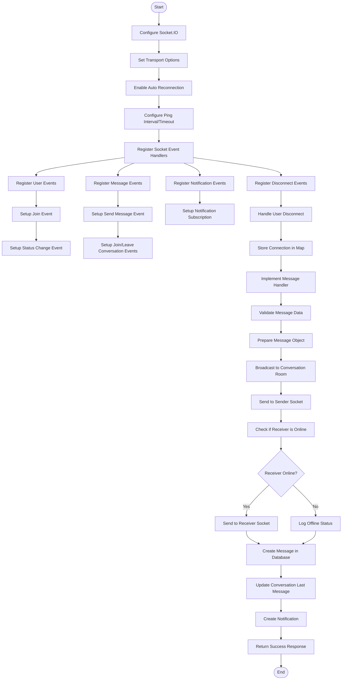
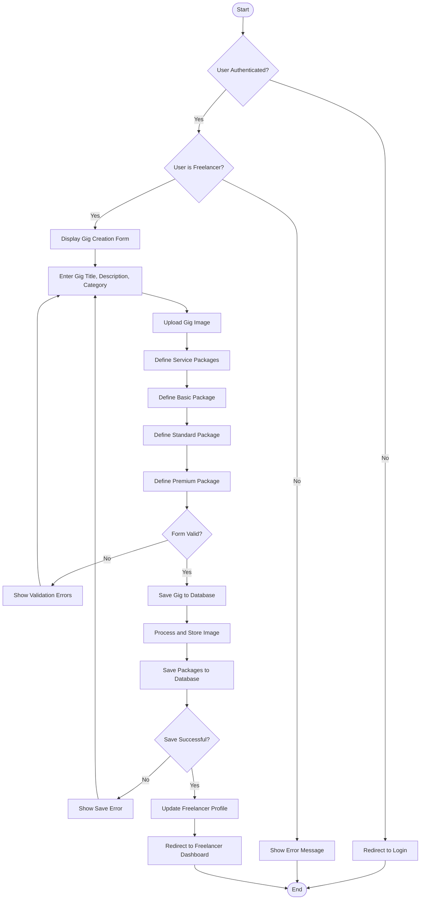

# Activity Diagrams - Freelancing Web Application

## Overview
These activity diagrams illustrate the key processes in the Freelancing Web Application, showing the flow of activities and decisions for critical operations.

## Real-Time Messaging Process

## Order Creation Process

## Real-Time Messaging Implementation

## Gig Creation Process

## Description

These activity diagrams illustrate the key processes in the Freelancing Web Application:

### Real-Time Messaging Process
This diagram shows the flow of activities involved in the real-time messaging feature, which was previously fixed to address various issues:
- Socket connection initialization
- Conversation selection and room joining
- Message caching and retrieval
- Message composition and sending
- Error handling and retry mechanisms
- Attachment handling

Key improvements highlighted include:
- Proper socket connection configuration
- Enhanced message reception handling
- Improved message fetching and display
- Direct chat updates for immediate visibility
- Message sorting by timestamp
- Automatic scrolling to latest messages

### Order Creation Process
This diagram illustrates how clients create orders in the system:
- Gig browsing and selection
- Package selection (Basic, Standard, Premium)
- Authentication verification
- Requirement specification
- Payment processing
- Order creation and notification

### Real-Time Messaging Implementation
This technical diagram shows the backend implementation of the real-time messaging system:
- Socket.IO configuration with proper transport options
- Event handler registration
- Message validation and broadcasting
- Online status tracking
- Database persistence
- Conversation updates

### Gig Creation Process
This diagram shows how freelancers create service offerings:
- Authentication and authorization checks
- Basic information entry
- Image upload
- Package definition for different service tiers
- Validation and persistence
- Profile updates

These activity diagrams provide a comprehensive view of the control flow in key processes of the Freelancing Web Application, highlighting both user interactions and system processing.
