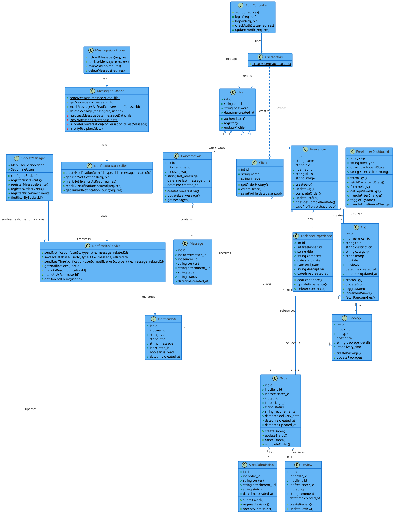
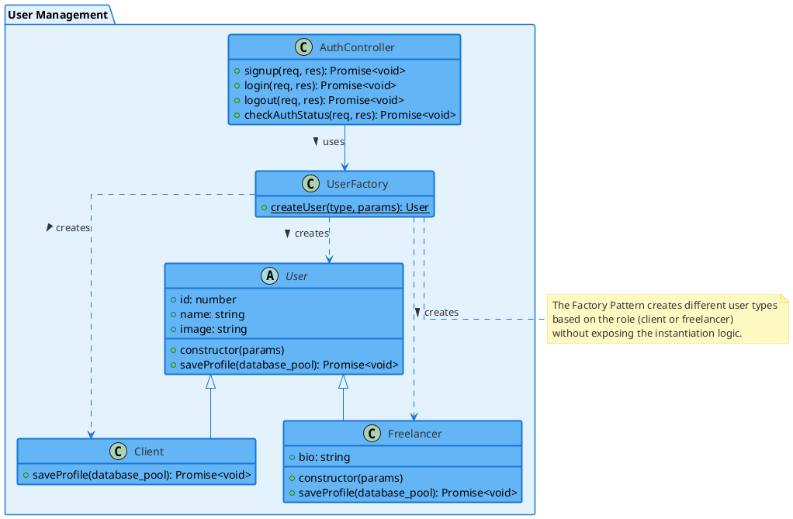
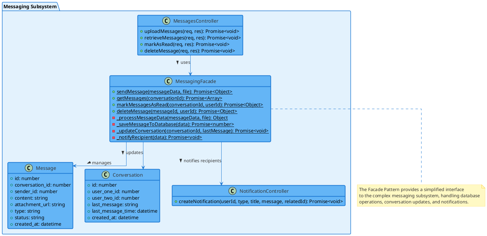
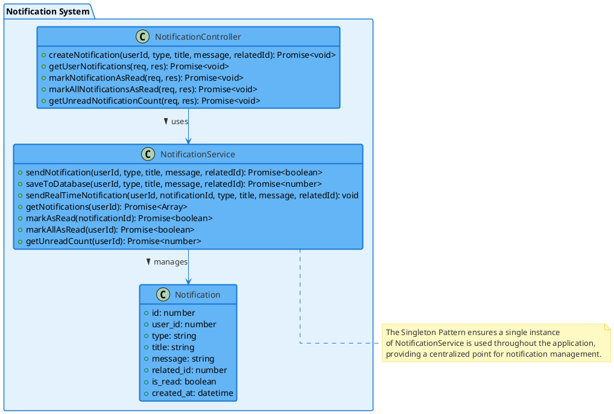
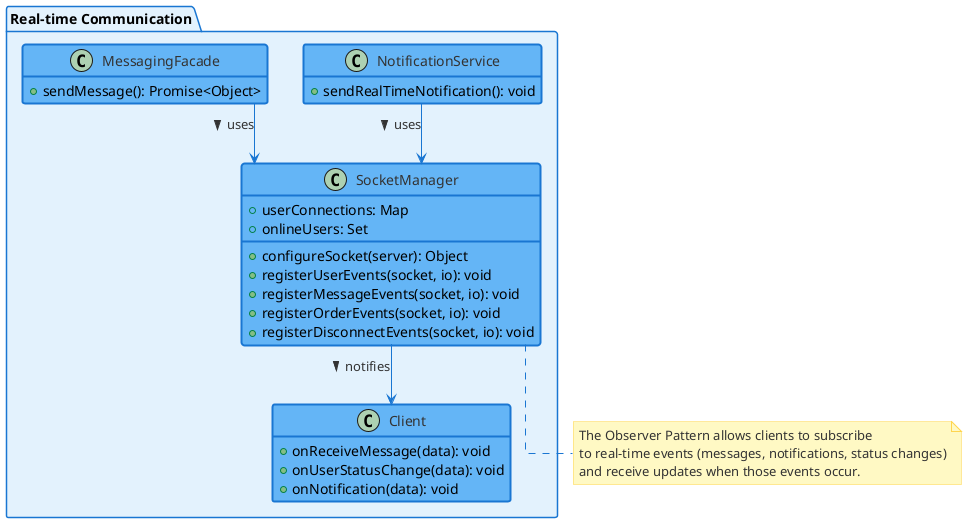

# Class Diagram - Freelancing Web Application

## Overview
This diagram illustrates the key classes and their relationships in the Freelancing Web Application, aligned with the database schema and code implementation.

## Diagram

### Backend Design Patterns

Your Freelancing Web Application implements several design patterns to maintain a clean, maintainable, and extensible architecture. These patterns help organize your code, separate concerns, and make the system more robust.

#### 1. Factory Pattern (User Management)

**Implementation**: The Factory Pattern is used in your `UserFactory` class to create different types of users (Client or Freelancer) based on the user type. This pattern encapsulates the object creation logic, making your code more maintainable and allowing for easy addition of new user types in the future.

**Benefits**:
- Centralizes user creation logic
- Makes the system more flexible when adding new user types
- Simplifies the authentication controller by delegating user creation

#### 2. Facade Pattern (Messaging System)

**Implementation**: The `MessagingFacade` class provides a simplified interface to the complex messaging subsystem. It encapsulates database operations, conversation updates, and notification creation behind a clean API, making it easier for controllers to interact with the messaging system.

**Benefits**:
- Simplifies the messaging interface for client code
- Centralizes related operations (saving messages, updating conversations, sending notifications)
- Reduces dependencies between components
- Improves code maintainability

#### 3. Singleton Pattern (Notification Service)

**Implementation**: The `NotificationService` is implemented as a singleton to ensure a single point of access throughout the application. This pattern is appropriate for services that need to maintain state and provide consistent behavior across the application.

**Benefits**:
- Ensures only one instance of the service exists
- Provides a global point of access to the service
- Conserves resources by avoiding multiple instances
- Maintains consistent state for notifications

#### 4. Observer Pattern (Socket Communication)

**Implementation**: Your socket implementation uses the Observer Pattern to handle real-time communication. Clients subscribe to events (by joining rooms or registering event handlers), and the server notifies them when relevant events occur (new messages, notifications, status changes).

**Benefits**:
- Enables real-time updates without polling
- Decouples event producers from event consumers
- Allows for dynamic subscription and unsubscription
- Supports broadcasting to multiple clients

## Description

The class diagram illustrates the main entities and their relationships in the Freelancing Web Application, aligned with the database schema and code implementation:

### User Management
- **User**: The base class for all users in the system
- **UserFactory**: Creates appropriate user types based on role
- **Client**: Extends User, representing clients who order services
- **Freelancer**: Extends User, representing freelancers who provide services
- **AuthController**: Handles authentication operations including signup, login, and session management

### Gig Management
- **Gig**: Represents services offered by freelancers
- **Package**: Represents different service tiers for a gig (Basic, Standard, Premium)

### Order Management
- **Order**: Represents a transaction between a client and a freelancer
- **WorkSubmission**: Deliverables submitted for orders
- **Review**: Represents feedback provided after order completion

### Communication
- **Conversation**: Manages communication between users
- **Message**: Individual messages within a conversation
- **MessagingFacade**: Simplifies interactions with the messaging subsystem
- **Notification**: System notifications for various events

### System Components
- **SocketManager**: Handles real-time communications
- **NotificationService**: Singleton service for managing notifications
- **FreelancerDashboard**: Manages the freelancer's view of their gigs and statistics

## Design Patterns

1. **Factory Pattern**: The UserFactory creates appropriate user objects (Client or Freelancer) based on the user type.

2. **Facade Pattern**: The MessagingFacade simplifies complex messaging operations behind a clean interface.

3. **Singleton Pattern**: The NotificationService is implemented as a singleton to ensure a single point of access.

4. **Observer Pattern**: The socket implementation allows clients to subscribe to events and receive real-time updates.

## Relationships

- A User can be either a Client or a Freelancer
- The UserFactory creates User objects of different types
- Freelancers create Gigs with multiple Packages
- Clients place Orders for specific Gigs and Packages
- Orders can receive Reviews and WorkSubmissions
- Users participate in Conversations that contain Messages
- Users receive Notifications about system events
- SocketManager enables real-time communication for Messages and Notifications
