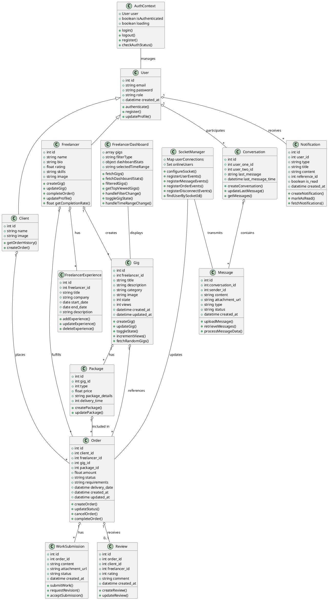
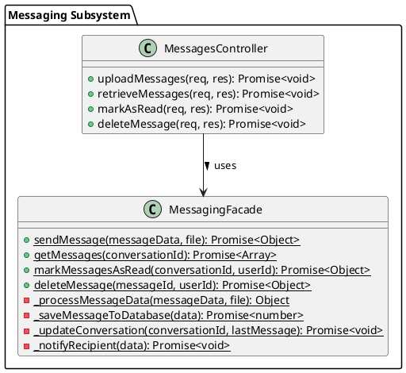
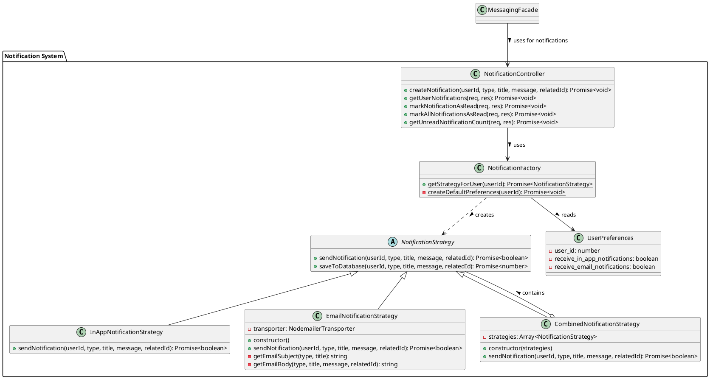

# Class Diagram - Freelancing Web Application

## Overview
This diagram illustrates the key classes and their relationships in the Freelancing Web Application.

## Diagram

### Design Patterns Implementation

#### Facade Pattern for Messaging

#### Strategy Pattern for Notifications

## Description

The class diagram illustrates the main entities and their relationships in the Freelancing Web Application:

### User Management
- **User**: The base class for all users in the system
- **Client**: Extends User, representing clients who order services
- **Freelancer**: Extends User, representing freelancers who provide services

### Gig Management
- **Gig**: Represents services offered by freelancers
- **Package**: Represents different service tiers for a gig (Basic, Standard, Premium)

### Order Management
- **Order**: Represents a transaction between a client and a freelancer
- **Review**: Represents feedback provided after order completion

### Communication
- **Conversation**: Manages communication between users
- **Message**: Individual messages within a conversation
- **Notification**: System notifications for various events

### System Components
- **SocketManager**: Handles real-time communications
- **AuthContext**: Manages authentication state

## Relationships

- A User can be either a Client or a Freelancer
- Freelancers create Gigs with multiple Packages
- Clients place Orders for specific Gigs and Packages
- Orders can receive Reviews after completion
- Users participate in Conversations that contain Messages
- Users receive Notifications about system events
- SocketManager handles real-time transmission of Messages and Notifications
- AuthContext manages the authentication state of Users
