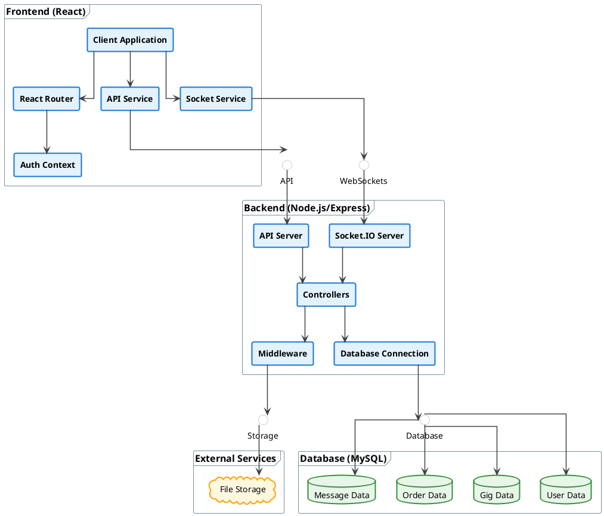

# Component Diagram - Freelancing Web Application

## Overview
This diagram illustrates the major components of the Freelancing Web Application and their interactions.

## Diagram

## Description

The component diagram illustrates the high-level architecture of the Freelancing Web Application, showing major components and their interactions:

### Frontend (React)
- **Client Application**: The main React application
- **Router**: Manages navigation between different pages
- **Context**: Contains authentication and other global state
- **Pages**: Different views/screens of the application
- **Components**: Reusable UI components

### Backend (Node.js/Express)
- **API Server**: Handles HTTP requests
- **Socket.IO Server**: Manages real-time communications
- **Router**: Routes requests to appropriate controllers
- **Controller**: Contains business logic for each feature
- **Middleware**: Handles cross-cutting concerns like authentication

### Database (MySQL)
- **Database Connection**: Manages connections to the database
- **Tables**: Various database tables for storing application data

### External Services
- **File Storage**: Service for storing uploaded files

## Interactions
- The Frontend communicates with the Backend through HTTP requests and WebSocket connections
- The Backend interacts with the Database to store and retrieve data
- The Backend uses External Services for file storage
- Within the Frontend, the Router directs users to different Pages based on URL
- Within the Backend, Routers direct requests to appropriate Controllers, which interact with the Database
