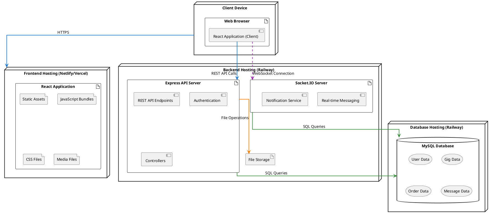

# Deployment Diagram - Freelancing Web Application

## Overview
This diagram illustrates the deployment architecture of the Freelancing Web Application, showing how the components are distributed across the infrastructure.

## Diagram

## Description

This deployment diagram illustrates how the Freelancing Web Application is distributed across different hosting environments:

### Client Tier
- **Client Device**: End-user computers, tablets, or mobile devices
  - **Web Browser**: The client-side environment where users interact with the application
  - **React Application (Client)**: The client-side application running in the browser

### Frontend Tier (Netlify/Vercel)
- **React Application**: The compiled and optimized React application
  - **Static Assets**: Basic HTML files and resources
  - **JavaScript Bundles**: Compiled React code
  - **CSS Files**: Styling for the application
  - **Media Files**: Images, icons, and other media resources

### Backend Tier (Railway)
- **Express API Server**: Handles HTTP requests and business logic
  - **REST API Endpoints**: Interface for client communication
  - **Authentication**: User authentication and authorization
  - **Controllers**: Business logic implementation
- **Socket.IO Server**: Manages real-time communication
  - **Real-time Messaging**: Handles chat functionality
  - **Notification Service**: Manages user notifications
- **File Storage**: Stores uploaded files and documents (gig images, user profiles, etc.)

### Database Tier (Railway)
- **MySQL Database**: Stores all application data
  - **User Data**: User accounts, profiles, and authentication information
  - **Gig Data**: Freelancer service offerings and packages
  - **Order Data**: Client orders and work submissions
  - **Message Data**: Chat messages and notifications

### Communication Flows
- Clients communicate with the frontend via HTTPS
- Browser applications make REST API calls to the backend
- Real-time features use WebSocket connections to the Socket.IO server
- Backend services communicate with the database via SQL queries
- File operations are handled through the dedicated file storage service

- **Browser to React App**: HTTP/HTTPS requests for initial page load and static assets
- **Browser to Socket.IO Server**: WebSocket connection for real-time messaging and notifications
- **React App to API Server**: HTTP/HTTPS API requests for data operations
- **API Server to MySQL**: Database queries for CRUD operations
- **Socket.IO Server to MySQL**: Database queries for real-time features
- **API Server to File Storage**: File operations for uploads and retrievals

## Infrastructure Considerations

1. **Scalability**:
   - Frontend can scale horizontally through CDN distribution
   - Backend can scale with additional instances behind a load balancer
   - Socket.IO may require sticky sessions for persistent connections

2. **Security**:
   - HTTPS/WSS for all connections
   - JWT for authentication
   - CORS policies to prevent unauthorized access

3. **Performance**:
   - CDN caching for static assets
   - Connection pooling for database access
   - Optimized WebSocket configuration for real-time communication

4. **Reliability**:
   - Database backups
   - Error logging and monitoring
   - Graceful degradation when real-time features are unavailable
