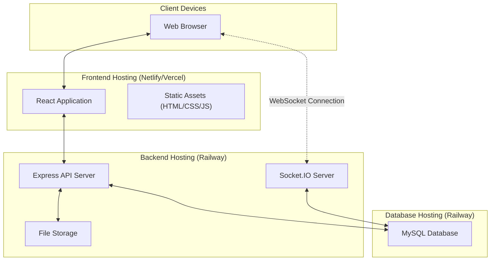

# Deployment Diagram - Freelancing Web Application

## Overview
This diagram illustrates the deployment architecture of the Freelancing Web Application, showing how the components are distributed across the infrastructure.

## Diagram

## Description

This deployment diagram illustrates how the Freelancing Web Application is distributed across different hosting environments:

### Client Tier
- **Web Browser**: The client-side environment where users interact with the application
  - Runs HTML, CSS, and JavaScript code
  - Maintains WebSocket connections for real-time features

### Frontend Tier (Netlify/Vercel)
- **React Application**: The compiled and optimized React application
- **Static Assets**: HTML, CSS, JavaScript, and media files

### Backend Tier (Railway)
- **Express API Server**: Handles HTTP API requests
- **Socket.IO Server**: Manages real-time WebSocket connections
- **File Storage**: Stores uploaded files (gig images, message attachments, etc.)

### Database Tier (Railway)
- **MySQL Database**: Persistent storage for all application data

## Communication Paths

- **Browser to React App**: HTTP/HTTPS requests for initial page load and static assets
- **Browser to Socket.IO Server**: WebSocket connection for real-time messaging and notifications
- **React App to API Server**: HTTP/HTTPS API requests for data operations
- **API Server to MySQL**: Database queries for CRUD operations
- **Socket.IO Server to MySQL**: Database queries for real-time features
- **API Server to File Storage**: File operations for uploads and retrievals

## Infrastructure Considerations

1. **Scalability**:
   - Frontend can scale horizontally through CDN distribution
   - Backend can scale with additional instances behind a load balancer
   - Socket.IO may require sticky sessions for persistent connections

2. **Security**:
   - HTTPS/WSS for all connections
   - JWT for authentication
   - CORS policies to prevent unauthorized access

3. **Performance**:
   - CDN caching for static assets
   - Connection pooling for database access
   - Optimized WebSocket configuration for real-time communication

4. **Reliability**:
   - Database backups
   - Error logging and monitoring
   - Graceful degradation when real-time features are unavailable
