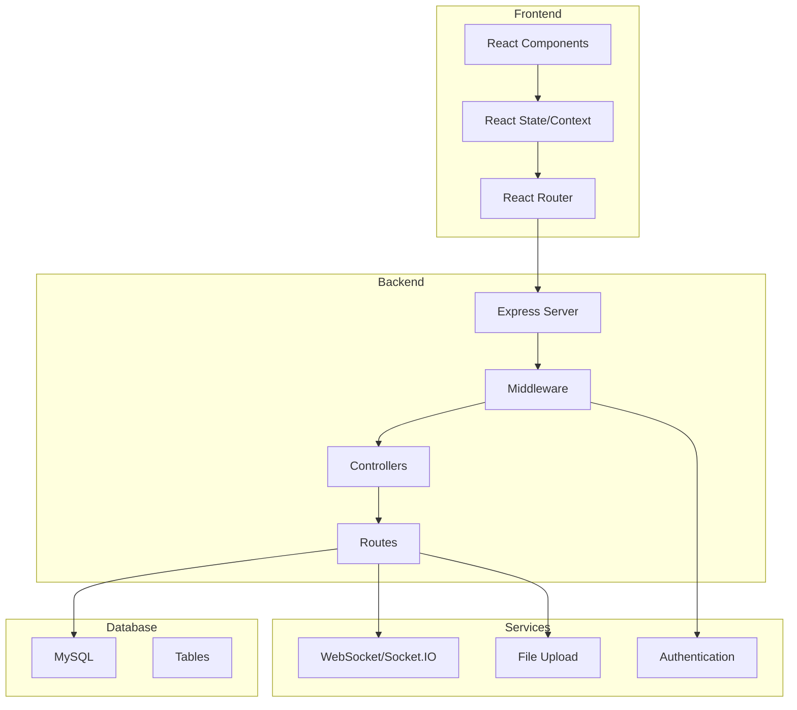
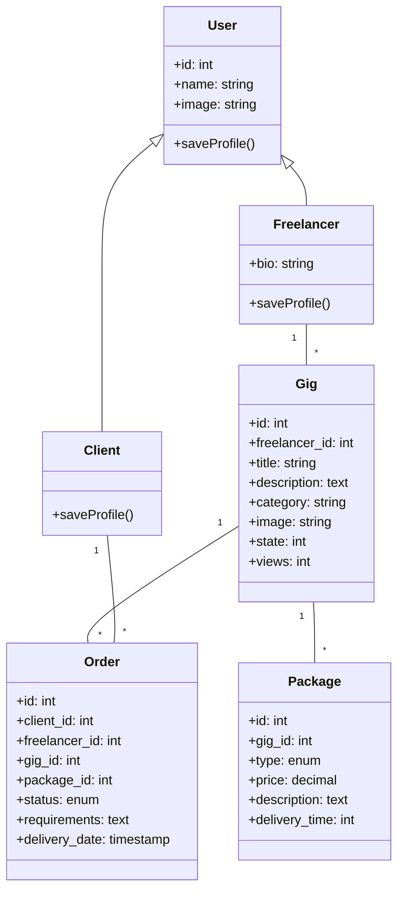
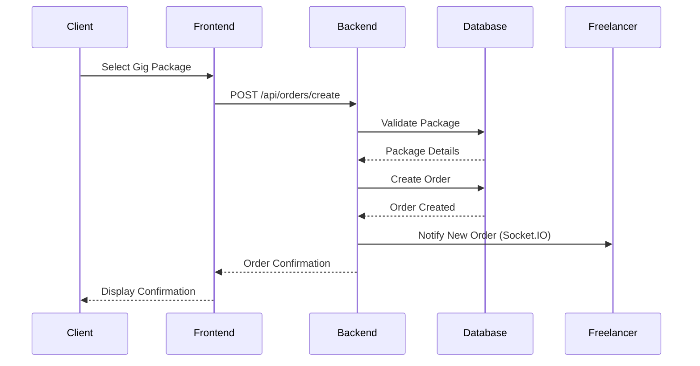
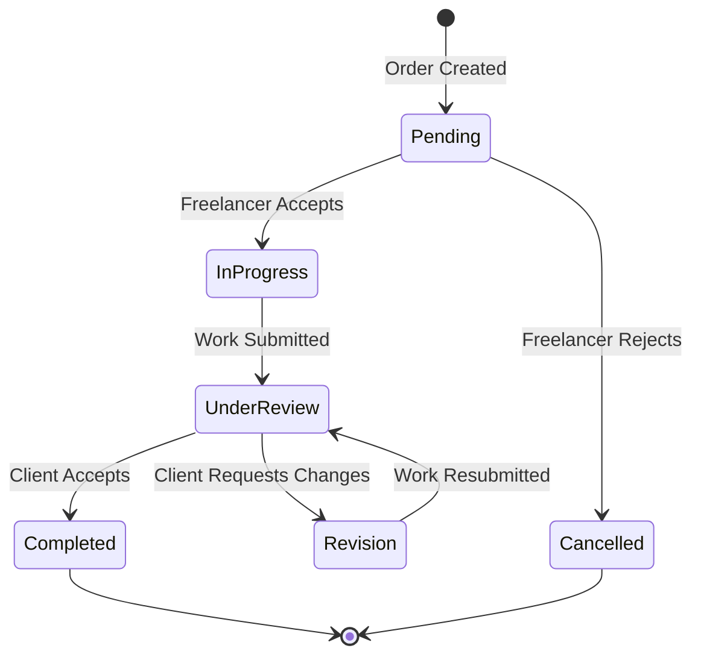
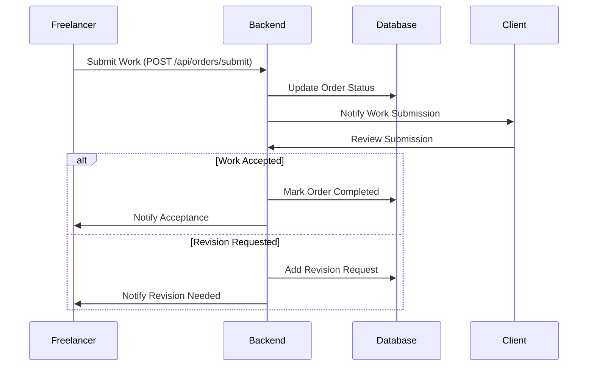

# Freelancing Web Application - Software Design Document (IEEE 1016-2009)

## 1. Introduction

### 1.1 Purpose of the System
The Freelancing Web Application is a comprehensive platform designed to facilitate connections between freelancers and clients. It provides a secure marketplace where freelancers can offer their services through gigs, and clients can discover and purchase these services.

### 1.2 Document Conventions
- Code snippets are enclosed in ```language``` blocks
- File paths are indicated in `monospace`
- Technical terms are *italicized* when first introduced
- Important notes are **bold**

### 1.3 Intended Audience
- Software developers and engineers
- System architects
- Project managers
- Quality assurance team
- System administrators
- Technical stakeholders

### 1.4 Project Scope
The system encompasses:
- User authentication and authorization
- Gig creation and management
- Order processing and fulfillment
- Real-time messaging
- Profile management
- Reviews and ratings
- Payment processing
- Administrative functions

### 1.5 References
- IEEE 1016-2009 Standard for Software Design Descriptions
- Node.js and Express.js documentation
- React.js documentation
- MySQL documentation
- Socket.IO documentation

## 2. System Overview

### 2.1 High-Level System Goals
1. Provide a secure and efficient marketplace for freelance services
2. Enable real-time communication between clients and freelancers
3. Facilitate secure payment processing
4. Maintain user privacy and data security
5. Ensure scalability and performance under load

### 2.2 Technology Stack
- **Frontend:**
  - React.js with Vite
  - Material-UI
  - React Router DOM
  - Socket.IO Client
  - React Toastify

- **Backend:**
  - Node.js
  - Express.js
  - MySQL
  - Socket.IO
  - JWT for authentication
  - Bcrypt for password hashing
  - Multer for file uploads

- **Development Tools:**
  - Git for version control
  - ESLint for code quality
  - Environment configuration via dotenv

### 2.3 Major Components
1. Authentication System
2. User Management
3. Gig Management
4. Messaging System
5. Order Processing
6. Review System
7. File Upload System
8. Payment Processing

## 3. Architectural Design

### 3.1 System Architecture Diagram


### 3.2 Class Diagram


### 3.3 Sequence Diagram - Order Creation


### 3.4 Component Structure
```
Frontend/
├── src/
│   ├── Components/
│   │   ├── Navbar/
│   │   │   ├── Client/
│   │   │   └── Freelancer/
│   │   └── Footer/
│   ├── Pages/
│   │   ├── Home/
│   │   ├── Login/
│   │   ├── Signup/
│   │   ├── Dashboard/
│   │   ├── GigDisplay/
│   │   ├── Messages/
│   │   └── Settings/
│   ├── context/
│   │   ├── AuthContext
│   │   └── ThemeContext
│   └── utils/
│       ├── api.js
│       └── helpers.js

Backend/
├── controller/
│   ├── Authentication.js
│   ├── Gig.js
│   ├── Messages.js
│   ├── Profile.js
│   └── Packages.js
├── router/
│   ├── authenticationRoutes.js
│   ├── gigRouter.js
│   └── messageRouter.js
├── utils/
│   ├── UserFactory.js
│   └── constants.js
└── config/
    └── dbconnection.js
```

### 3.5 Database Schema
```sql
CREATE TABLE users (
    id INT PRIMARY KEY AUTO_INCREMENT,
    email VARCHAR(255) UNIQUE NOT NULL,
    password VARCHAR(255) NOT NULL,
    created_at TIMESTAMP DEFAULT CURRENT_TIMESTAMP
);

CREATE TABLE freelancers (
    id INT PRIMARY KEY,
    name VARCHAR(255) NOT NULL,
    bio TEXT,
    image VARCHAR(255),
    rating DECIMAL(3,2) DEFAULT 0.00,
    FOREIGN KEY (id) REFERENCES users(id)
);

CREATE TABLE clients (
    id INT PRIMARY KEY,
    name VARCHAR(255) NOT NULL,
    image VARCHAR(255),
    FOREIGN KEY (id) REFERENCES users(id)
);

CREATE TABLE gigs (
    id INT PRIMARY KEY AUTO_INCREMENT,
    freelancer_id INT NOT NULL,
    title VARCHAR(255) NOT NULL,
    description TEXT NOT NULL,
    category VARCHAR(100) NOT NULL,
    image VARCHAR(255),
    state TINYINT DEFAULT 1,
    views INT DEFAULT 0,
    created_at TIMESTAMP DEFAULT CURRENT_TIMESTAMP,
    FOREIGN KEY (freelancer_id) REFERENCES freelancers(id)
);

CREATE TABLE packages (
    id INT PRIMARY KEY AUTO_INCREMENT,
    gig_id INT NOT NULL,
    type ENUM('1','2','3') NOT NULL,
    price DECIMAL(10,2) NOT NULL,
    description TEXT NOT NULL,
    delivery_time INT NOT NULL,
    FOREIGN KEY (gig_id) REFERENCES gigs(id)
);

CREATE TABLE orders (
    id INT PRIMARY KEY AUTO_INCREMENT,
    client_id INT NOT NULL,
    freelancer_id INT NOT NULL,
    gig_id INT NOT NULL,
    package_id INT NOT NULL,
    status ENUM('pending','in_progress','completed','cancelled') NOT NULL,
    requirements TEXT,
    created_at TIMESTAMP DEFAULT CURRENT_TIMESTAMP,
    delivery_date TIMESTAMP,
    FOREIGN KEY (client_id) REFERENCES clients(id),
    FOREIGN KEY (freelancer_id) REFERENCES freelancers(id),
    FOREIGN KEY (gig_id) REFERENCES gigs(id),
    FOREIGN KEY (package_id) REFERENCES packages(id)
);

CREATE TABLE messages (
    id INT PRIMARY KEY AUTO_INCREMENT,
    sender_id INT NOT NULL,
    receiver_id INT NOT NULL,
    content TEXT NOT NULL,
    created_at TIMESTAMP DEFAULT CURRENT_TIMESTAMP,
    FOREIGN KEY (sender_id) REFERENCES users(id),
    FOREIGN KEY (receiver_id) REFERENCES users(id)
);

CREATE TABLE reviews (
    id INT PRIMARY KEY AUTO_INCREMENT,
    order_id INT NOT NULL,
    client_id INT NOT NULL,
    freelancer_id INT NOT NULL,
    rating INT NOT NULL CHECK (rating BETWEEN 1 AND 5),
    comment TEXT,
    created_at TIMESTAMP DEFAULT CURRENT_TIMESTAMP,
    FOREIGN KEY (order_id) REFERENCES orders(id),
    FOREIGN KEY (client_id) REFERENCES clients(id),
    FOREIGN KEY (freelancer_id) REFERENCES freelancers(id)
);
```

## 4. Detailed Design

### 4.1 Authentication Module
```javascript
// Authentication flow
1. User submits credentials
2. Backend validates and hashes password
3. JWT token generated and returned
4. Token stored in frontend
5. Subsequent requests include token
```

### 4.2 Key Components

#### 4.2.1 User Management
- User Factory Pattern implementation
- Role-based access control
- Profile management

#### 4.2.2 Gig Management
- CRUD operations for gigs
- File upload handling
- Search and filtering

#### 4.2.3 Messaging System
- Real-time chat using Socket.IO
- Message persistence
- Conversation management

#### 4.2.4 Order and Package Management
```javascript
// Package Types
1. Basic Package (Type = 1)
2. Standard Package (Type = 2)
3. Premium Package (Type = 3)

// Order States
1. Pending
2. In Progress
3. Completed
4. Cancelled
```

#### Database Schema
```sql
Package {
  id: INT (PK)
  gig_id: INT (FK)
  type: ENUM(1, 2, 3)
  price: DECIMAL
  description: TEXT
  delivery_time: INT
}

Order {
  id: INT (PK)
  client_id: INT (FK)
  freelancer_id: INT (FK)
  gig_id: INT (FK)
  package_id: INT (FK)
  status: ENUM
  created_at: TIMESTAMP
  requirements: TEXT
  delivery_date: TIMESTAMP
}
```

#### Implementation Details
1. **Package Management:**
   - Each gig has three package tiers (Basic, Standard, Premium)
   - Packages include price, delivery time, and features
   - Basic package price is used for gig listing displays
   - Packages are retrieved using `fetchPackagesByGigId` endpoint

2. **Order Processing:**
   - Orders are created when a client purchases a gig package
   - Order status is tracked through various states
   - Delivery dates are calculated based on package delivery time
   - Real-time notifications for order status changes

3. **Order Workflow:**
   ```javascript
   // Order Creation Flow
   1. Client selects a gig package
   2. System validates package availability
   3. Order created with PENDING status
   4. Freelancer notified of new order
   5. Freelancer accepts/rejects order
   6. If accepted, status changes to IN_PROGRESS
   ```

4. **API Endpoints:**
   - `/api/packages/gig/:id` - Get packages for a gig
   - `/api/orders/create` - Create new order
   - `/api/orders/status` - Update order status
   - `/api/orders/client/:id` - Get client's orders
   - `/api/orders/freelancer/:id` - Get freelancer's orders

5. **Security Measures:**
   - Order creation restricted to authenticated clients
   - Order status updates restricted to involved parties
   - Payment validation before order confirmation
   - Rate limiting on order creation endpoints

### 4.3 API Endpoints
- `/api/auth/*` - Authentication routes
- `/api/gigs/*` - Gig management
- `/api/messages/*` - Messaging system
- `/api/orders/*` - Order processing
- `/api/reviews/*` - Review system

### 4.2 Design Patterns Implementation

#### 4.2.1 Factory Pattern (User Creation)
```javascript
// UserFactory.js implementation
class User {
  constructor({ id, name, image }) {
    this.id = id;
    this.name = name;
    this.image = image;
  }
  async saveProfile() {
    throw new Error('saveProfile() must be implemented');
  }
}

class Client extends User {
  async saveProfile(database_pool) {
    await database_pool.query(
      'INSERT INTO clients(Id, Name, Image) VALUES (?, ?, ?)',
      [this.id, this.name, this.image]
    );
  }
}

class Freelancer extends User {
  constructor({ id, name, bio, image }) {
    super({ id, name, image });
    this.bio = bio;
  }
  async saveProfile(database_pool) {
    await database_pool.query(
      'INSERT INTO freelancers(Id, Name, bio, Image) VALUES (?, ?, ?, ?)',
      [this.id, this.name, this.bio, this.image]
    );
  }
}
```

#### 4.2.2 Observer Pattern (Real-time Updates)
```javascript
// Socket.IO implementation for real-time updates
io.on('connection', (socket) => {
  socket.on('join', (userId) => {
    socket.join(`user_${userId}`);
  });
  
  socket.on('message', (data) => {
    io.to(`user_${data.receiverId}`).emit('new_message', data);
  });
  
  socket.on('order_update', (data) => {
    io.to(`user_${data.userId}`).emit('order_status_changed', data);
  });
});
```

#### 4.2.3 MVC Pattern
```javascript
// Model (Database Queries)
const fetchGig = async (gigId) => {
  const [result] = await database_pool.query(
    'SELECT * FROM gigs WHERE id = ?',
    [gigId]
  );
  return result[0];
};

// Controller (Business Logic)
const gigController = async (req, res) => {
  try {
    const gig = await fetchGig(req.params.id);
    res.json(gig);
  } catch (err) {
    res.status(500).json({ error: err.message });
  }
};

// View (React Component)
const GigDisplay = ({ gigId }) => {
  const [gig, setGig] = useState(null);
  
  useEffect(() => {
    fetchGigData(gigId).then(setGig);
  }, [gigId]);
  
  return (
    <div className="gig-container">
      <h1>{gig?.title}</h1>
      <p>{gig?.description}</p>
    </div>
  );
};
```

#### 4.2.5 Work Submission and Order Management

##### Order Management Flow


##### Dashboard Views

1. **Client Dashboard**
```javascript
// Components and Features
- Order tracking and history
- Active orders management
- Gig search and filtering
- Price range filters
- Category-based browsing
- Freelancer ratings view
```

2. **Freelancer Dashboard**
```javascript
// Components and Features
- Gig management (active/paused)
- Order status tracking
- Earnings overview
- Completion rate metrics
- Rating display
- Work submission interface
```

##### Work Submission Process


##### Order Management Implementation

1. **Order States and Transitions**
```sql
CREATE TABLE order_status_history (
    id INT PRIMARY KEY AUTO_INCREMENT,
    order_id INT NOT NULL,
    status ENUM('pending', 'in_progress', 'under_review', 'revision', 'completed', 'cancelled'),
    notes TEXT,
    created_at TIMESTAMP DEFAULT CURRENT_TIMESTAMP,
    FOREIGN KEY (order_id) REFERENCES orders(id)
);
```

2. **Work Submission**
```javascript
// Work Submission API
const submitWork = async (req, res) => {
    const { orderId, deliverables, message } = req.body;
    try {
        // Update order status
        await database_pool.query(
            'UPDATE orders SET status = "under_review" WHERE id = ?',
            [orderId]
        );
        
        // Add submission record
        await database_pool.query(
            'INSERT INTO submissions (order_id, deliverables, message) VALUES (?, ?, ?)',
            [orderId, deliverables, message]
        );
        
        // Notify client
        io.to(`user_${clientId}`).emit('work_submitted', { orderId });
        
        res.status(200).json({ message: "Work submitted successfully" });
    } catch (err) {
        res.status(500).json({ error: err.message });
    }
};
```

3. **Order Review Process**
```javascript
// Client Review API
const reviewSubmission = async (req, res) => {
    const { orderId, isAccepted, revisionNotes } = req.body;
    try {
        if (isAccepted) {
            await completeOrder(orderId);
        } else {
            await requestRevision(orderId, revisionNotes);
        }
        res.status(200).json({ message: "Review processed successfully" });
    } catch (err) {
        res.status(500).json({ error: err.message });
    }
};
```

4. **Dashboard Views Implementation**
```javascript
// Freelancer Dashboard Component
const FreelancerDashboard = () => {
    const [stats, setStats] = useState({
        totalEarnings: 0,
        activeOrders: 0,
        completionRate: 0,
        avgRating: 0
    });
    
    const [orders, setOrders] = useState([]);
    
    useEffect(() => {
        fetchDashboardStats();
        fetchActiveOrders();
    }, []);
    
    // Dashboard rendering logic
};

// Client Dashboard Component
const ClientDashboard = () => {
    const [activeOrders, setActiveOrders] = useState([]);
    const [searchFilters, setSearchFilters] = useState({
        category: 'All',
        priceRange: { min: '', max: '' },
        searchQuery: ''
    });
    
    // Filter and search implementation
};
```

5. **Real-time Updates**
```javascript
// Socket.IO event handlers
io.on('connection', (socket) => {
    socket.on('join_order_room', (orderId) => {
        socket.join(`order_${orderId}`);
    });
    
    socket.on('work_submitted', (data) => {
        io.to(`order_${data.orderId}`).emit('work_update', {
            type: 'submission',
            data: data
        });
    });
    
    socket.on('revision_requested', (data) => {
        io.to(`order_${data.orderId}`).emit('work_update', {
            type: 'revision',
            data: data
        });
    });
});
```

## 5. Data Design

### 5.1 Database Schema

```sql
User {
  id: INT (PK)
  email: VARCHAR
  password: VARCHAR(hashed)
  created_at: TIMESTAMP
}

Profile {
  id: INT (PK)
  user_id: INT (FK)
  name: VARCHAR
  bio: TEXT
  image: VARCHAR
  user_type: ENUM
}

Gig {
  id: INT (PK)
  freelancer_id: INT (FK)
  title: VARCHAR
  description: TEXT
  price: DECIMAL
  created_at: TIMESTAMP
}
```

### 5.2 Data Validation Rules
1. Email must be unique and valid format
2. Passwords must meet complexity requirements
3. Gig prices must be positive values
4. File uploads limited to specific types and sizes

## 6. User Interface Design

### 6.1 Component Hierarchy
```
App
├── Navbar
├── Pages
│   ├── Home
│   ├── Login/Signup
│   ├── Dashboard
│   ├── GigDisplay
│   ├── Messages
│   └── Settings
└── Footer
```

### 6.2 Routing Structure
- Protected routes using `ProtectedRoute` component
- Role-based access control
- Client/Freelancer specific routes

## 7. Security Design

### 7.1 Authentication
- JWT-based authentication
- Password hashing with bcrypt
- Session management

### 7.2 Authorization
- Role-based access control
- Route protection
- Resource access validation

### 7.3 Security Measures
- Input sanitization
- XSS protection
- CSRF protection
- Rate limiting
- Secure file upload validation

## 8. Error Handling & Logging

### 8.1 Error Handling Strategy
- Global error handler middleware
- Try-catch blocks in async operations
- User-friendly error messages
- Error status codes standardization

### 8.2 Logging
- Request logging
- Error logging
- Authentication events
- File upload events

## 9. Deployment & Environment Configuration

### 9.1 Environment Variables
```
DB_HOST=localhost
DB_USER=root
DB_PASSWORD=****
DB_NAME=skillify
JWT_SECRET=****
```

### 9.2 Build Process
1. Frontend build with Vite
2. Backend deployment with Node.js
3. Database migration scripts
4. Static asset handling

## 10. Appendices

### 10.1 Dependencies
#### Frontend
- react
- react-router-dom
- @mui/material
- socket.io-client
- axios

#### Backend
- express
- mysql2
- jsonwebtoken
- bcrypt
- multer
- socket.io

### 10.2 Future Improvements
1. Implement caching layer
2. Add payment gateway integration
3. Enhance search functionality
4. Add real-time notifications
5. Implement service worker for offline support

### 10.3 Glossary
- **Gig:** A service package offered by a freelancer
- **JWT:** JSON Web Token
- **Socket.IO:** Library for real-time bidirectional communication
- **MVC:** Model-View-Controller architecture pattern 