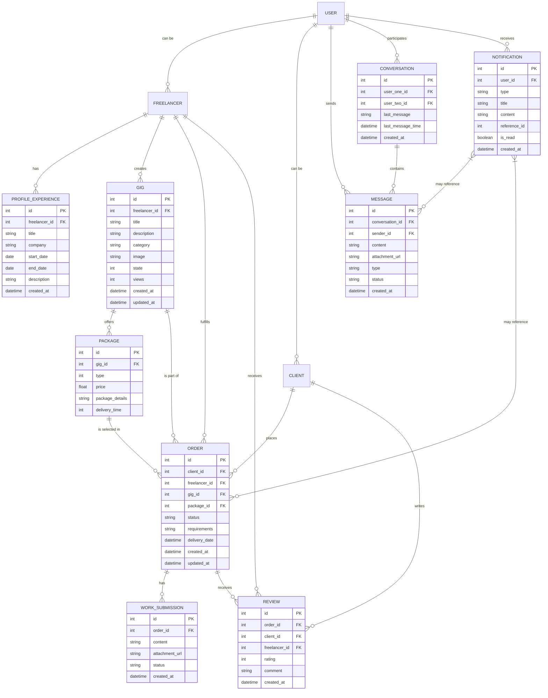

# Entity-Relationship Diagram - Freelancing Web Application

## Overview
This diagram illustrates the database structure of the Freelancing Web Application, showing entities and their relationships.

## Diagram

## Description

This Entity-Relationship diagram illustrates the database structure of the Freelancing Web Application, showing all entities with their attributes and relationships based on the actual implementation:

### User Management
- **USER**: Central entity representing all users in the system with authentication information
- **FREELANCER**: Extends USER with freelancer-specific attributes like skills, bio, and rating
- **CLIENT**: Extends USER with client-specific attributes
- **PROFILE_EXPERIENCE**: Work experience entries associated with freelancers' profiles

### Gig Management
- **GIG**: Services offered by freelancers, including title, description, category, and tracking metrics like views
- **PACKAGE**: Service tiers for gigs (Basic, Standard, Premium) with different price points and delivery times

### Order Processing
- **ORDER**: Transactions between clients and freelancers, including status tracking and requirements
- **WORK_SUBMISSION**: Deliverables submitted for orders with content and attachment information
- **REVIEW**: Ratings and feedback provided after order completion

### Communication System
- **CONVERSATION**: Chat channels between users with last message tracking
- **MESSAGE**: Individual messages within conversations, including attachment support and status tracking
- **NOTIFICATION**: System notifications for various events like new messages and order updates

## Key Relationships

1. **User Role Relationships**:
   - A USER can be either a FREELANCER or a CLIENT (1-to-1 relationship)
   - FREELANCER can have multiple PROFILE_EXPERIENCE entries (1-to-many)

2. **Gig Management Relationships**:
   - FREELANCER creates multiple GIGs (1-to-many)
   - Each GIG offers multiple PACKAGEs (1-to-many)

3. **Order Processing Relationships**:
   - CLIENT places multiple ORDERs (1-to-many)
   - FREELANCER fulfills multiple ORDERs (1-to-many)
   - ORDER is associated with one GIG and one PACKAGE (many-to-1)
   - ORDER can have multiple WORK_SUBMISSION entries (1-to-many)
   - ORDER can receive multiple REVIEWs (1-to-many)

4. **Communication Relationships**:
   - USER participates in multiple CONVERSATIONs (many-to-many)
   - CONVERSATION contains multiple MESSAGEs (1-to-many)
   - USER sends multiple MESSAGEs (1-to-many)
   - USER receives multiple NOTIFICATIONs (1-to-many)
   - NOTIFICATION may reference MESSAGE or ORDER (many-to-many)

## Implementation Details

1. **Entity Attributes**:
   - Each entity contains attributes reflecting the actual database schema
   - Primary keys (PK) uniquely identify each record
   - Foreign keys (FK) establish relationships between entities
   - Timestamp attributes track creation and modification times

2. **State Tracking**:
   - ORDER includes status field to track order lifecycle
   - MESSAGE includes status field to track delivery status
   - NOTIFICATION includes is_read flag to track user interaction

3. **Reference System**:
   - NOTIFICATION uses reference_id and type to link to various entities
   - This enables a flexible notification system that can reference different objects

This diagram provides a comprehensive view of the data structure supporting the Freelancing Web Application, with special attention to the real-time messaging system, order processing, and freelancer profile management features.
