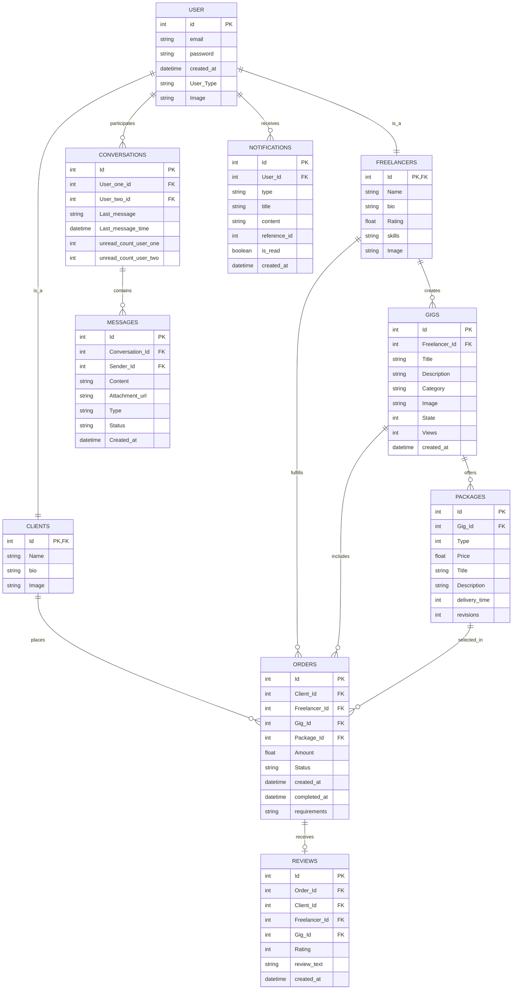

# Entity-Relationship Diagram - Freelancing Web Application

## Overview
This diagram illustrates the database structure of the Freelancing Web Application, showing entities and their relationships.

## Diagram

## Description

The Entity-Relationship diagram illustrates the database structure of the Freelancing Web Application:

### User Entities
- **USER**: Central entity representing all users in the system
- **FREELANCERS**: Extends USER for freelancer-specific attributes
- **CLIENTS**: Extends USER for client-specific attributes

### Service Entities
- **GIGS**: Services offered by freelancers
- **PACKAGES**: Different service tiers for gigs (Basic, Standard, Premium)

### Transaction Entities
- **ORDERS**: Transactions between clients and freelancers
- **REVIEWS**: Feedback provided after order completion

### Communication Entities
- **CONVERSATIONS**: Communication channels between users
- **MESSAGES**: Individual messages within conversations
- **NOTIFICATIONS**: System notifications for various events

## Relationships

- A USER can be either a FREELANCER or a CLIENT (1-to-1 relationship)
- FREELANCERS create multiple GIGS (1-to-many relationship)
- GIGS offer multiple PACKAGES (1-to-many relationship)
- CLIENTS place multiple ORDERS (1-to-many relationship)
- FREELANCERS fulfill multiple ORDERS (1-to-many relationship)
- ORDERS include a specific GIG and PACKAGE (many-to-1 relationships)
- ORDERS can receive one REVIEW (1-to-0/1 relationship)
- USERS participate in multiple CONVERSATIONS (many-to-many relationship)
- CONVERSATIONS contain multiple MESSAGES (1-to-many relationship)
- USERS receive multiple NOTIFICATIONS (1-to-many relationship)

## Key Constraints
- Primary keys (PK) are used to uniquely identify each record
- Foreign keys (FK) establish relationships between entities
- User-related entities use the same ID as the base USER entity
