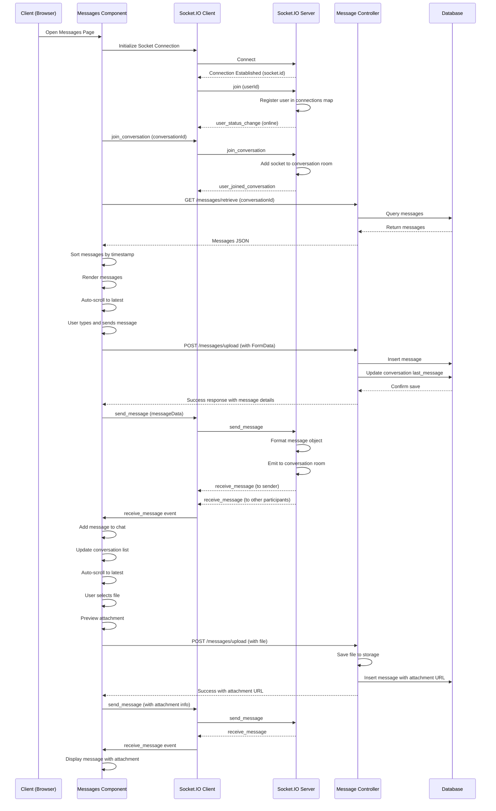
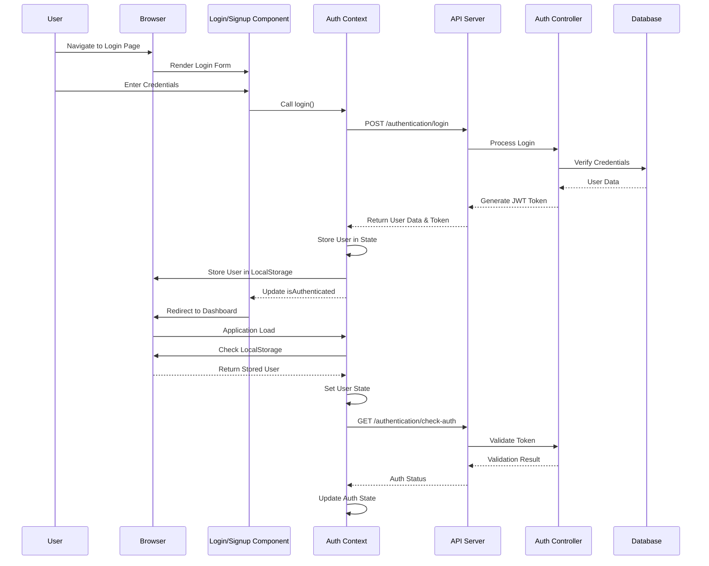
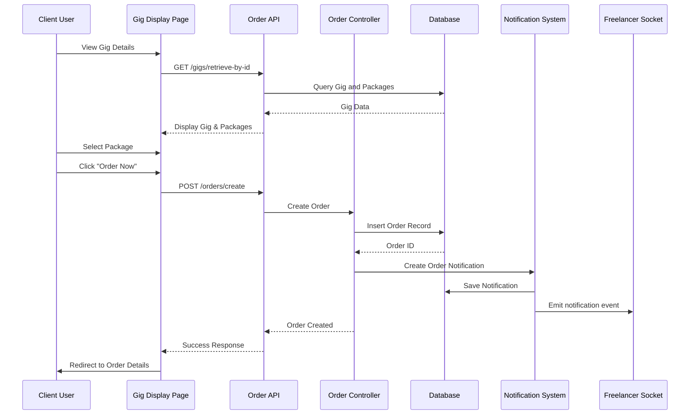
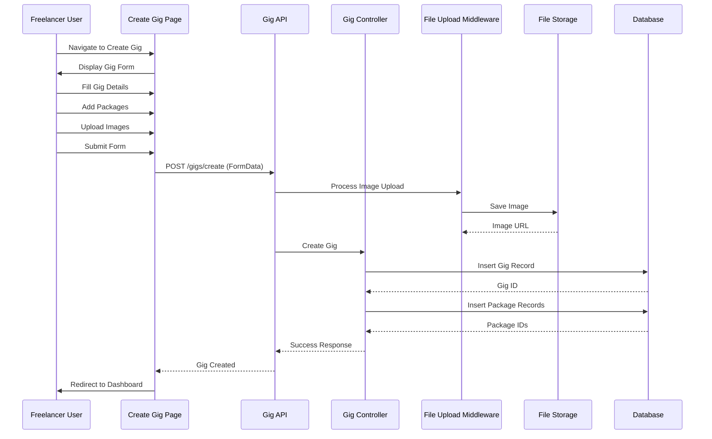

# Sequence Diagrams - Freelancing Web Application

## Overview
These sequence diagrams illustrate key interactions and processes in the Freelancing Web Application, with special focus on the real-time messaging system.

## Real-Time Messaging Sequence

## Authentication Sequence

## Order Creation Sequence

## Gig Creation Sequence

## Notable Interactions

These sequence diagrams illustrate key interactions in the Freelancing Web Application:

1. **Real-Time Messaging**:
   - Socket connection establishment
   - Joining conversation rooms
   - Message retrieval and sorting
   - Real-time message delivery
   - Attachment handling

2. **Authentication**:
   - Login process
   - Token handling
   - Authentication checking

3. **Order Creation**:
   - Browsing gigs
   - Creating an order
   - Notification delivery

4. **Gig Creation**:
   - Form interaction
   - File upload handling
   - Database operations

These diagrams showcase the interaction between frontend components, backend services, and the database, highlighting the flow of data and the sequence of operations in the application.
