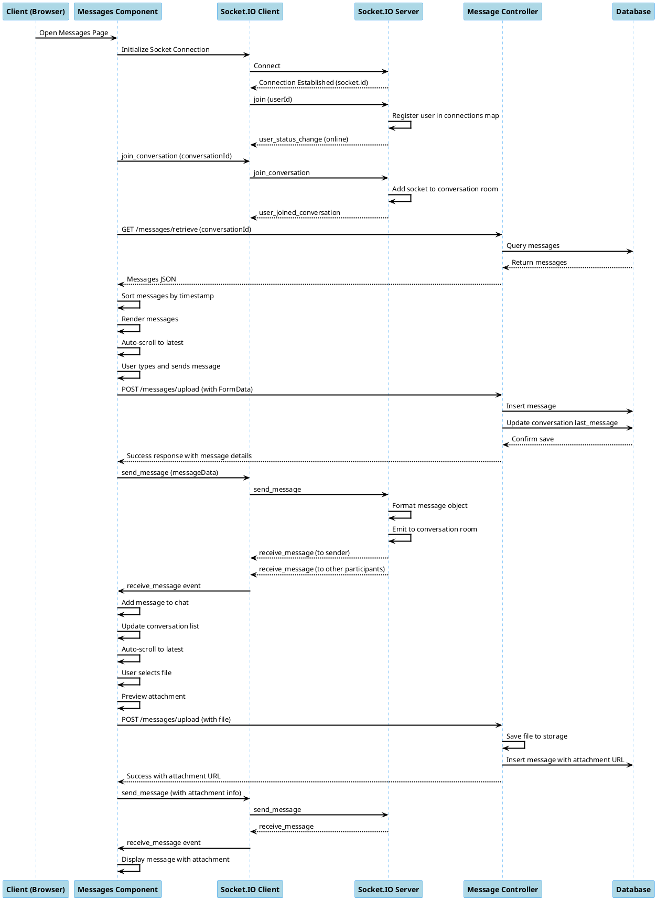
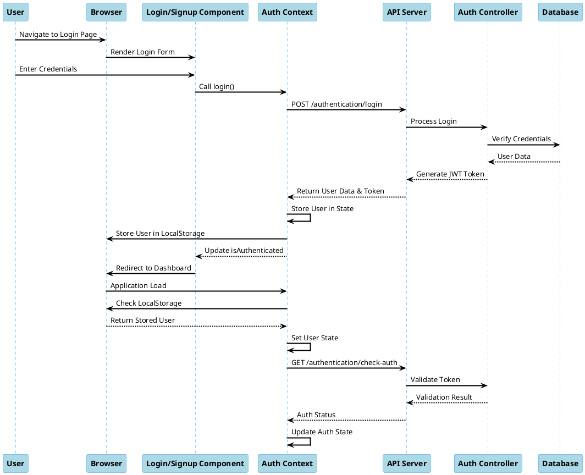
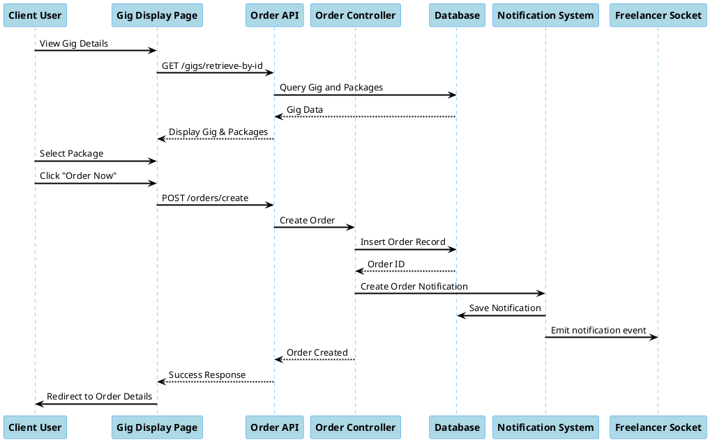
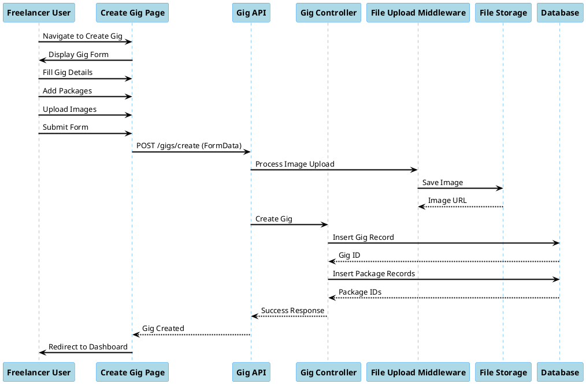
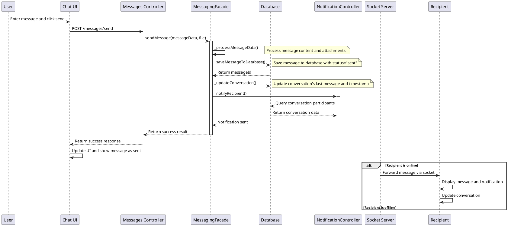
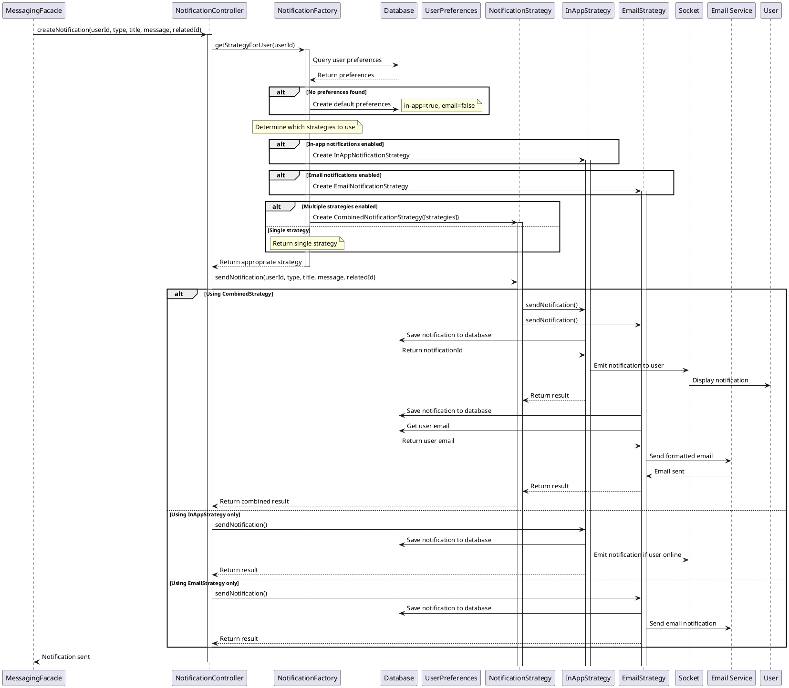

# Sequence Diagrams - Freelancing Web Application

## Overview
These sequence diagrams illustrate key interactions and processes in the Freelancing Web Application, with special focus on the real-time messaging system, including the implemented Facade and Strategy design patterns.

## Real-Time Messaging Sequence

## Authentication Sequence

## Order Creation Sequence

## Gig Creation Sequence

## Message Exchange with Facade Pattern

## Notification Delivery with Strategy Pattern

## Notable Interactions

These sequence diagrams illustrate key interactions in the Freelancing Web Application:

1. **Real-Time Messaging with Facade Pattern**:
   - Using MessagingFacade to simplify message handling
   - Centralized message processing and database operations
   - Notification delivery through the facade
   - Real-time message delivery via sockets

2. **Notification System with Strategy Pattern**:
   - Dynamic selection of notification strategies based on user preferences
   - In-app notifications through socket connections
   - Email notifications with formatted templates
   - Combined notification delivery for multiple channels

3. **Authentication**:
   - Login process
   - Token handling
   - Authentication checking

4. **Order Creation**:
   - Browsing gigs
   - Creating an order
   - Notification delivery

5. **Gig Creation**:
   - Form interaction
   - File upload handling
   - Database operations

These diagrams showcase the interaction between frontend components, backend services, and the database, highlighting the flow of data and the sequence of operations in the application. The implementation of design patterns improves code organization, maintainability, and extensibility.
