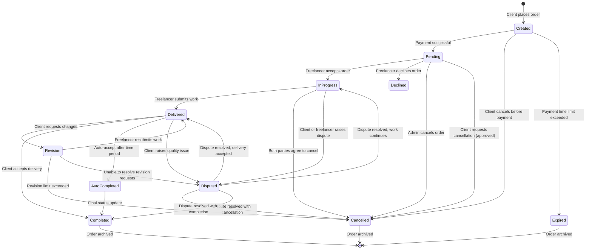
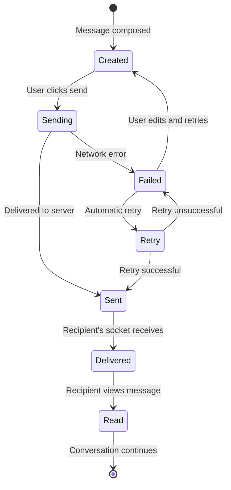

# State Transition Diagram - Freelancing Web Application

## Overview
This state transition diagram illustrates the lifecycle of an order in the Freelancing Web Application, which is one of the most critical aspects of the system as it represents the core business transaction between clients and freelancers.

## Order Lifecycle State Diagram

## Message Status State Diagram

## Description

### Order Lifecycle States

1. **Created**: Initial state when a client places an order
2. **Pending**: Order is created and awaiting freelancer acceptance
3. **InProgress**: Freelancer has accepted and is working on the order
4. **Delivered**: Freelancer has submitted the completed work
5. **Revision**: Client has requested changes to the delivered work
6. **Completed**: Order has been successfully fulfilled and accepted
7. **AutoCompleted**: Order automatically marked as complete after a time period
8. **Cancelled**: Order has been terminated before completion
9. **Disputed**: Order has issues that require intervention
10. **Expired**: Order has timed out without action

### Message Status States

1. **Created**: Message is composed but not yet sent
2. **Sending**: Message is in the process of being sent
3. **Sent**: Message has been successfully sent to the server
4. **Delivered**: Message has been received by the recipient's device
5. **Read**: Message has been viewed by the recipient
6. **Failed**: Message failed to send due to network issues
7. **Retry**: System is attempting to resend the message

### Key Transitions

#### Order Transitions:
- Client actions can move an order to Created, Cancelled, Revision, Completed, or Disputed states
- Freelancer actions can move an order to InProgress, Delivered, or Declined states
- System can automatically transition to AutoCompleted or Expired states
- Disputes can be resolved in multiple ways, leading to different resulting states

#### Message Transitions:
- User actions trigger Created and Sending states
- Network conditions determine success (Sent) or failure (Failed)
- Recipient actions trigger Read state
- System automatically handles Delivered state and Retry attempts

This state transition diagram provides a comprehensive view of how orders and messages progress through different states based on user actions and system events, capturing the complex business logic of the Freelancing Web Application.
