# UML Use Case Diagram - Freelancing Web Application

## Overview
This diagram illustrates the primary use cases of the Freelancing Web Application using formal UML notation, with a focus on include and extend relationships between use cases.

## Diagram

```mermaid
classDiagram
    %% Actors
    class Client {
        <<Actor>>
    }
    
    class Freelancer {
        <<Actor>>
    }
    
    class System {
        <<Actor>>
    }
    
    %% Use Cases - Authentication & Profile
    class RegisterAccount {
        <<Use Case>>
    }
    
    class Login {
        <<Use Case>>
    }
    
    class ManageProfile {
        <<Use Case>>
    }
    
    class ViewFreelancerProfile {
        <<Use Case>>
    }
    
    %% Use Cases - Client Activities
    class SearchGigs {
        <<Use Case>>
    }
    
    class BrowseGigs {
        <<Use Case>>
    }
    
    class ViewGigDetails {
        <<Use Case>>
    }
    
    class PlaceOrder {
        <<Use Case>>
    }
    
    class SelectPackage {
        <<Use Case>>
    }
    
    class SubmitRequirements {
        <<Use Case>>
    }
    
    class PayForOrder {
        <<Use Case>>
    }
    
    class ManageClientOrders {
        <<Use Case>>
    }
    
    class SubmitReview {
        <<Use Case>>
    }
    
    %% Use Cases - Freelancer Activities
    class CreateGig {
        <<Use Case>>
    }
    
    class ManageGigs {
        <<Use Case>>
    }
    
    class DefinePackages {
        <<Use Case>>
    }
    
    class UploadPortfolio {
        <<Use Case>>
    }
    
    class ManageFreelancerOrders {
        <<Use Case>>
    }
    
    class AcceptRejectOrder {
        <<Use Case>>
    }
    
    class DeliverWork {
        <<Use Case>>
    }
    
    class UploadDeliverables {
        <<Use Case>>
    }
    
    class RequestRevision {
        <<Use Case>>
    }
    
    %% Use Cases - Communication
    class SendMessage {
        <<Use Case>>
    }
    
    class ViewConversation {
        <<Use Case>>
    }
    
    class AttachFile {
        <<Use Case>>
    }
    
    class ViewNotifications {
        <<Use Case>>
    }
    
    %% Use Cases - System Operations
    class ProcessPayment {
        <<Use Case>>
    }
    
    class SendNotification {
        <<Use Case>>
    }
    
    class HandleFileUpload {
        <<Use Case>>
    }
    
    class ManageRealTimeCommunication {
        <<Use Case>>
    }
    
    %% Client Associations
    Client --> RegisterAccount
    Client --> Login
    Client --> ManageProfile
    Client --> SearchGigs
    Client --> BrowseGigs
    Client --> PlaceOrder
    Client --> ManageClientOrders
    Client --> SubmitReview
    Client --> SendMessage
    Client --> ViewNotifications
    
    %% Freelancer Associations
    Freelancer --> RegisterAccount
    Freelancer --> Login
    Freelancer --> ManageProfile
    Freelancer --> ViewFreelancerProfile
    Freelancer --> CreateGig
    Freelancer --> ManageGigs
    Freelancer --> ManageFreelancerOrders
    Freelancer --> DeliverWork
    Freelancer --> SendMessage
    Freelancer --> ViewNotifications
    
    %% System Associations
    System --> ProcessPayment
    System --> SendNotification
    System --> HandleFileUpload
    System --> ManageRealTimeCommunication
    
    %% Include Relationships (dashed line with <<include>>)
    PlaceOrder ..> SelectPackage : <<include>>
    PlaceOrder ..> SubmitRequirements : <<include>>
    PlaceOrder ..> PayForOrder : <<include>>
    
    CreateGig ..> DefinePackages : <<include>>
    CreateGig ..> UploadPortfolio : <<include>>
    
    ManageGigs ..> CreateGig : <<include>>
    
    DeliverWork ..> UploadDeliverables : <<include>>
    
    SendMessage ..> ViewConversation : <<include>>
    
    %% Extend Relationships (dashed line with <<extend>>)
    ViewGigDetails ..> BrowseGigs : <<extend>>
    
    SubmitReview ..> ManageClientOrders : <<extend>>
    
    AcceptRejectOrder ..> ManageFreelancerOrders : <<extend>>
    
    RequestRevision ..> ManageClientOrders : <<extend>>
    
    AttachFile ..> SendMessage : <<extend>>
    
    %% System Relationships
    HandleFileUpload ..> UploadPortfolio : <<extend>>
    HandleFileUpload ..> UploadDeliverables : <<extend>>
    HandleFileUpload ..> AttachFile : <<extend>>
    
    ProcessPayment ..> PayForOrder : <<extend>>
    
    SendNotification ..> ViewNotifications : <<extend>>
    
    ManageRealTimeCommunication ..> SendMessage : <<extend>>
```

## Description

This UML Use Case Diagram illustrates the use cases of the Freelancing Web Application with formal UML notation, highlighting the include and extend relationships between use cases.

### Actors
- **Client**: Users who browse and purchase services
- **Freelancer**: Users who offer and provide services
- **System**: Automated components handling background operations

### Include Relationships
Include relationships (denoted by `<<include>>`) represent mandatory functionality that is always part of the base use case:

1. **Place Order includes:**
   - Select Package: Client must choose a service tier
   - Submit Requirements: Client must provide project details
   - Pay for Order: Client must complete payment

2. **Create Gig includes:**
   - Define Packages: Freelancer must set up service tiers
   - Upload Portfolio: Freelancer must provide work samples

3. **Manage Gigs includes:**
   - Create Gig: Creating gigs is part of gig management

4. **Deliver Work includes:**
   - Upload Deliverables: Freelancer must upload completed work

5. **Send Message includes:**
   - View Conversation: The conversation is always displayed when sending messages

### Extend Relationships
Extend relationships (denoted by `<<extend>>`) represent optional functionality that may be part of the base use case under certain conditions:

1. **View Gig Details extends Browse Gigs:**
   - Triggered when a client selects a specific gig

2. **Submit Review extends Manage Client Orders:**
   - Optional action after order completion

3. **Accept/Reject Order extends Manage Freelancer Orders:**
   - Triggered when a new order needs a response

4. **Request Revision extends Manage Client Orders:**
   - Optional action if client is not satisfied with delivered work

5. **Attach File extends Send Message:**
   - Optional action when sending messages

### System Interactions

1. **Handle File Upload extends:**
   - Upload Portfolio: System processes freelancer portfolio uploads
   - Upload Deliverables: System processes work deliverables
   - Attach File: System processes message attachments

2. **Process Payment extends Pay for Order:**
   - System handles payment processing when client completes an order

3. **Send Notification extends View Notifications:**
   - System generates notifications that users can view

4. **Manage Real-Time Communication extends Send Message:**
   - System handles real-time aspects of messaging

This diagram clearly illustrates the mandatory (include) and optional (extend) relationships between use cases, providing a comprehensive view of the system's functionality and the connections between different actions.
