# Use Case Diagram - Freelancing Web Application

## Overview
This diagram illustrates the primary use cases of the Freelancing Web Application from the perspective of its main actors.

## Diagram

```mermaid
graph TD
    %% Actors
    Client(["Client"])
    Freelancer(["Freelancer"])
    System(["System"])
    
    %% Common Use Cases
    UC1[Register Account]
    UC2[Login]
    UC3[Manage Profile]
    UC4[Send Messages]
    UC5[View Notifications]
    UC6[Search Gigs]
    
    %% Client Use Cases
    UC7[Browse Gigs]
    UC8[Place Order]
    UC9[Review Freelancer]
    UC10[Track Order Status]
    UC11[Manage Orders]
    
    %% Freelancer Use Cases
    UC12[Create Gig]
    UC13[Manage Gigs]
    UC14[Define Packages]
    UC15[Accept/Reject Orders]
    UC16[Deliver Completed Work]
    UC17[Receive Payments]
    
    %% System Use Cases
    UC18[Send Notifications]
    UC19[Process Payments]
    UC20[Manage Real-time Communications]
    UC21[Handle File Uploads]
    
    %% Common Relationships
    Client --- UC1
    Freelancer --- UC1
    Client --- UC2
    Freelancer --- UC2
    Client --- UC3
    Freelancer --- UC3
    Client --- UC4
    Freelancer --- UC4
    Client --- UC5
    Freelancer --- UC5
    Client --- UC6
    Freelancer --- UC6
    
    %% Client Relationships
    Client --- UC7
    Client --- UC8
    Client --- UC9
    Client --- UC10
    Client --- UC11
    
    %% Freelancer Relationships
    Freelancer --- UC12
    Freelancer --- UC13
    Freelancer --- UC14
    Freelancer --- UC15
    Freelancer --- UC16
    Freelancer --- UC17
    
    %% System Relationships
    System --- UC18
    System --- UC19
    System --- UC20
    System --- UC21
    
    %% Extensions and Inclusions
    UC8 -.-> UC7
    UC9 -.-> UC11
    UC13 -.-> UC12
    UC13 -.-> UC14
    UC16 -.-> UC15
    UC17 -.-> UC16
    UC18 -.-> UC5
    UC20 -.-> UC4
    UC21 -.-> UC12
    UC21 -.-> UC16
```

## Description

The Use Case Diagram for the Freelancing Web Application depicts the core functionality available to different actors in the system:

### Actors

1. **Client**: Users who browse and purchase services
2. **Freelancer**: Users who offer and provide services
3. **System**: Automated components handling notifications, payments, and communications

### Common Use Cases

- **Register Account**: Sign up for a new account
- **Login**: Authenticate and access the system
- **Manage Profile**: Update personal information and settings
- **Send Messages**: Communicate with other users
- **View Notifications**: See system and user-generated notifications
- **Search Gigs**: Find services using search functionality

### Client-Specific Use Cases

- **Browse Gigs**: View available services offered by freelancers
- **Place Order**: Purchase a service package
- **Review Freelancer**: Provide feedback after service completion
- **Track Order Status**: Monitor the progress of placed orders
- **Manage Orders**: View, cancel, or request revisions for orders

### Freelancer-Specific Use Cases

- **Create Gig**: Offer a new service
- **Manage Gigs**: Update or remove existing services
- **Define Packages**: Create different service tiers (Basic, Standard, Premium)
- **Accept/Reject Orders**: Review and respond to incoming order requests
- **Deliver Completed Work**: Submit finished work to clients
- **Receive Payments**: Get compensated for completed services

### System Use Cases

- **Send Notifications**: Generate and deliver system notifications
- **Process Payments**: Handle financial transactions
- **Manage Real-time Communications**: Facilitate instant messaging
- **Handle File Uploads**: Process and store uploaded files

### Relationships

- Associations connect actors to their primary use cases
- Extensions (dashed arrows) show optional or conditional flows
- Some use cases build upon or depend on others, such as:
  - Placing an order requires browsing gigs
  - Delivering work requires accepting orders
  - Creating packages is part of managing gigs

This diagram provides a high-level view of what users can do within the Freelancing Web Application, separated by user roles and system responsibilities.
