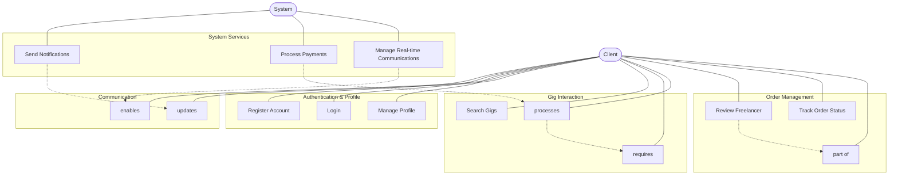
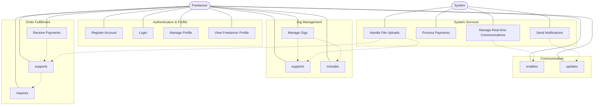

# Use Case Diagrams - Freelancing Web Application

## Overview
These diagrams illustrate the primary use cases of the Freelancing Web Application from the perspective of its main actors. We've created separate diagrams for Client and Freelancer roles to better illustrate the distinct functionalities available to each user type.

## Client Use Case Diagram

## Freelancer Use Case Diagram

## Description

The Use Case Diagrams for the Freelancing Web Application depict the core functionalities available to clients and freelancers, presented as separate diagrams for clarity.

### Client Use Cases

#### Authentication & Profile
- **Register Account**: Sign up for a new client account
- **Login**: Authenticate and access the system
- **Manage Profile**: Update personal information and settings

#### Communication
- **Send Messages**: Communicate with freelancers
- **View Notifications**: See system and user-generated notifications

#### Gig Interaction
- **Search Gigs**: Find services using search functionality
- **Browse Gigs**: View available services offered by freelancers
- **Place Order**: Purchase a service package

#### Order Management
- **Review Freelancer**: Provide feedback after service completion
- **Track Order Status**: Monitor the progress of placed orders
- **Manage Orders**: View, cancel, or request revisions for orders

### Freelancer Use Cases

#### Authentication & Profile
- **Register Account**: Sign up for a new freelancer account
- **Login**: Authenticate and access the system
- **Manage Profile**: Update personal information and settings
- **View Freelancer Profile**: Access the freelancer's public profile page

#### Communication
- **Send Messages**: Communicate with clients
- **View Notifications**: See system and user-generated notifications

#### Gig Management
- **Create Gig**: Offer a new service
- **Manage Gigs**: Update or remove existing services
- **Define Packages**: Create different service tiers (Basic, Standard, Premium)

#### Order Fulfillment
- **Accept/Reject Orders**: Review and respond to incoming order requests
- **Deliver Completed Work**: Submit finished work to clients
- **Receive Payments**: Get compensated for completed services

### System Services (Supporting Both Actors)

- **Send Notifications**: Generate and deliver system notifications
- **Process Payments**: Handle financial transactions
- **Manage Real-time Communications**: Facilitate instant messaging
- **Handle File Uploads**: Process and store uploaded files (primarily for freelancers)

### Key Relationships

#### Client Dependencies
- Placing an order requires browsing gigs first
- Writing reviews is part of order management
- System services support client activities

#### Freelancer Dependencies
- Managing gigs includes creating gigs and defining packages
- Delivering work requires accepting orders first
- Receiving payments follows after work delivery
- File uploads support both gig creation and work delivery

These diagrams provide a clear separation of user roles, making it easier to understand the specific capabilities and workflows for each type of user in the Freelancing Web Application.
