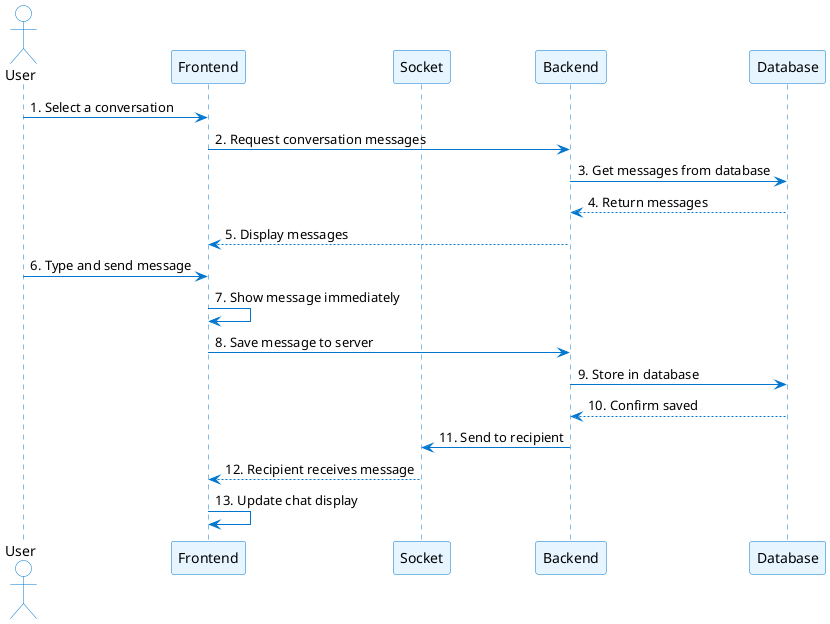
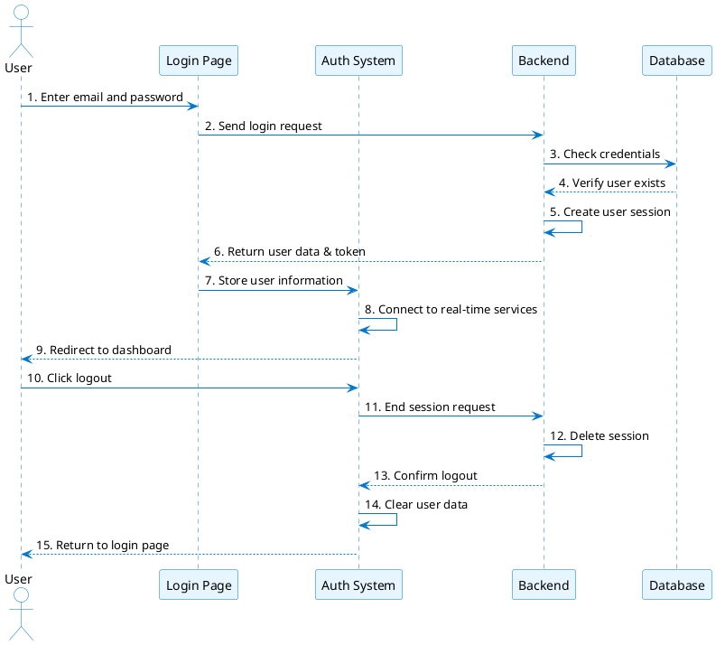
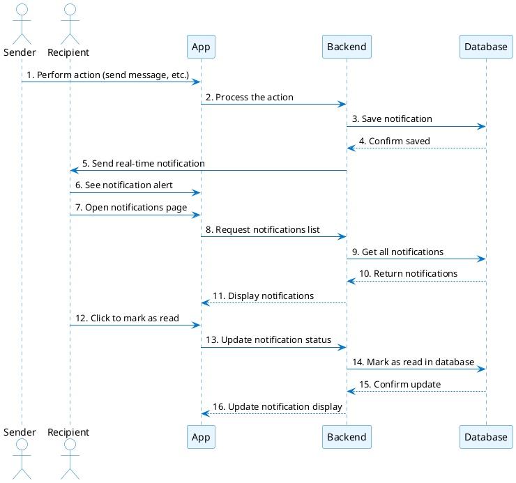
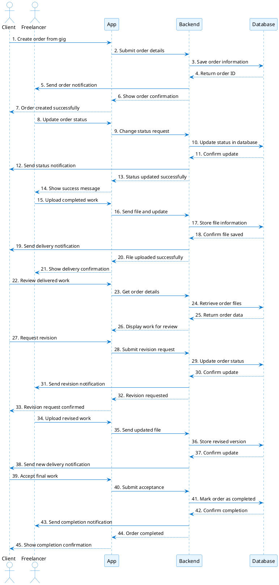

# Sequence Diagrams for Freelancing Web Application

This document contains simplified sequence diagrams for the main logic flows in the Freelancing Web Application.

## 1. Real-time Messaging System

## 2. Authentication Flow

## 3. Notification System

## 4. Order Management Flow

